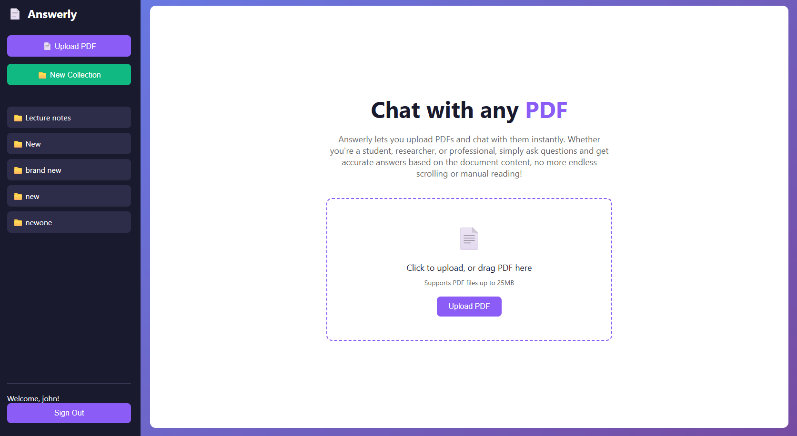
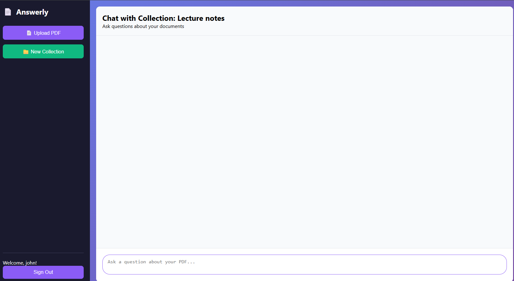

# 🧠 Answerly – Ask Questions from Your PDFs using AI

Answerly is an intelligent, fast, and extensible **PDF Chat Assistant** powered by **RAG (Retrieval-Augmented Generation)**. Users can upload single or multiple PDFs and interact with them conversationally. Each interaction is processed using vector embeddings + LLMs, and logged in **Snowflake** for future analytics and insights.

> 💡 Built with FastAPI, MongoDB, Hugging Face, and Snowflake for scalable AI Q&A from your documents.

---

## 🚀 Key Features

- ✅ Upload single PDFs anonymously and ask questions
- 🔐 Register/login and create document collections (multi-mode)
- 🧠 Retrieval-Augmented Generation (RAG) powered answers
- 📦 FAISS for vector search (single-mode)
- 💾 MongoDB for user-specific collection storage (multi-mode)
- ❄️ **Snowflake analytics integration** – logs all chats, questions, and answers
- 💬 Simple HTML/CSS frontend for quick testing

---

## 🧪 Frontend Preview

> ⚠️ The current frontend is a **minimal HTML/JavaScript interface** designed purely for API testing. A full-featured UI (Next.js) will be added soon.

 
 

---

## 🔧 Tech Stack

| Layer        | Technology                                 |
|--------------|--------------------------------------------|
| Backend      | FastAPI, Python, Pydantic                  |
| Embeddings   | Sentence Transformers (`all-MiniLM`)       |
| Vector DB    | FAISS (anonymous mode)                     |
| Storage      | MongoDB (multi-mode), Snowflake (analytics)|
| Auth         | JWT (via OAuth2PasswordRequestForm)        |
| Frontend     | Vanilla HTML/CSS/JS (test only)            |

---

## 🧠 How It Works

1. **User uploads** single or multiple PDFs
2. **Text is extracted** and chunked
3. Chunks are embedded using `all-MiniLM-L6-v2`
4. Chunks + embeddings are stored in:
   - FAISS (for single anonymous use)
   - MongoDB (for authenticated users and collections)
5. **User asks a question**
6. Relevant chunks are retrieved using vector similarity
7. **LLM generates the answer**
8. **Each chat interaction is logged to Snowflake**:
   - User ID, collection, question, chunks used, response, timestamp

---

## 📂 Folder Structure

answerly/
├── main.py                  # FastAPI main app
├── auth/
│   └── auth_utils.py        # JWT auth logic
├── ingestion/
│   └── pdf_loader.py        # Extracts text from PDF
├── chunking/
│   └── text_chunker.py      # Splits text into chunks
├── embedding/
│   └── embed_store.py       # Embedding + saving
├── rag/
│   └── qa_pipeline.py       # Core RAG logic
├── db/
│   └── db.py                # MongoDB functions
├── snowflake/
│   └── snowflake_utils.py   # Logs Q&A to Snowflake
├── static/
│   └── index.html           # Simple frontend (test only)
└── requirements.txt

⚙️ Setup Instructions

## 1. Clone the repository

git clone https://github.com/RaviyaLK/Answerly-Intelligent-Document-Q-A-Platform-with-RAG.git
cd RAG

## 2. Create & activate a virtual environment
python -m venv venv
source venv/bin/activate  # or venv\Scripts\activate (Windows)

## 3. Install dependencies
pip install -r requirements.txt

## 4. Create a .env file
# MongoDB
MONGO_URI=mongodb+srv://<your_mongodb_uri>

# Hugging Face
HF_API_KEY=hf_...

#JWT
SECRET_KEY=your_secret_key_here (python -c "import secrets; print(secrets.token_urlsafe(32))")

# Snowflake ( You have to create a snowflake account and create a DB)
SNOWFLAKE_USER=your_user
SNOWFLAKE_PASSWORD=your_password
SNOWFLAKE_ACCOUNT=your_account_region
SNOWFLAKE_DATABASE=your_db
SNOWFLAKE_SCHEMA=your_schema
SNOWFLAKE_WAREHOUSE=your_warehouse
 
 ## 5. Run the backend
 uvicorn main:app --reload --port 8001

## 6. Test with the frontend
cd static
open index.html  # or use a Live Server browser extension

---

## 👨‍💻 Author

Developed by [Ravindu Wijesekara](https://github.com/RaviyaLK) — Final Year SE Undergrad | AI + Backend Enthusiast

---
